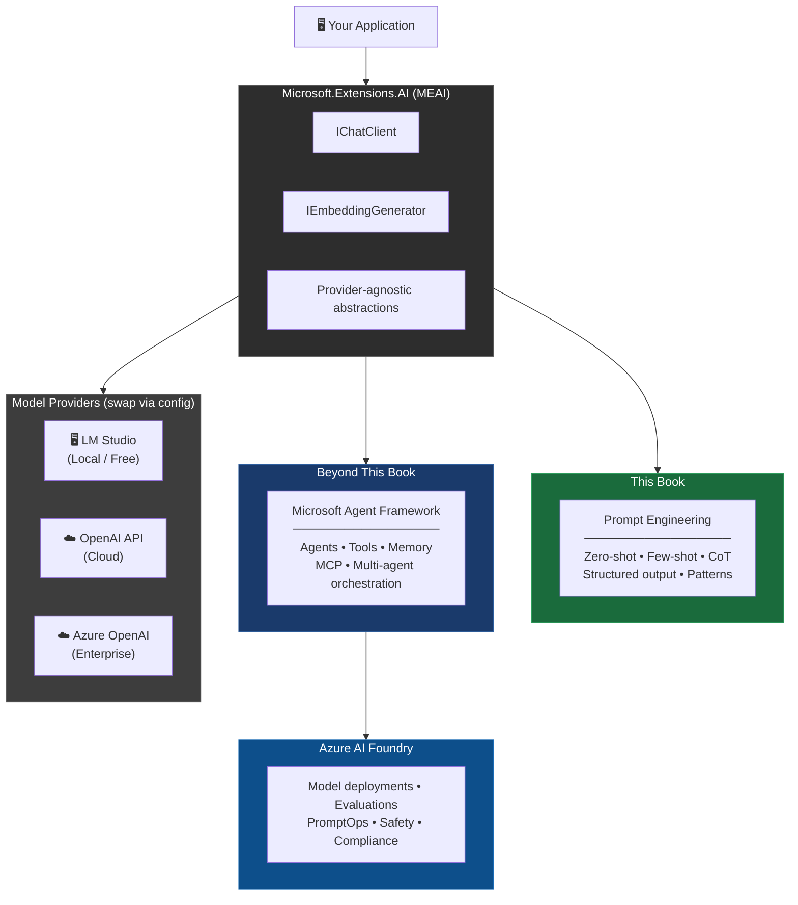

# Chapter 1 — The .NET Developer's AI Landscape

> **What you'll learn:** Why AI matters to C# developers (without the marketing speak), what LLMs actually are, how the Microsoft AI stack fits together, and where this book is taking you.

> **No code just a peek I promise in this chapter.** Just concepts, honest opinions, and a roadmap. The code starts in Chapter 2. Grab a coffee.

---

## 1.1 Let's Get the Elephant Out of the Room

You've seen the headlines.

*"AI will replace developers!"*  
*"Prompt engineering is the new programming!"*  
*"Just describe what you want and the AI builds it!"*

Here's the thing: someone has to build the AI features. Someone has to integrate the LLM into the billing system, the customer support portal, the internal knowledge base. Someone has to handle the edge cases, the retries, the token budgets, the prompt injection attacks.

That someone is you.

Welcome to the book that's not going to tell you that AI will replace your job. It's going to help you use AI to do your job better — and to build features that weren't worth the cost or engineering effort before LLMs became accessible.

Also: this book is in C#. No Python. No "just install Conda and then pip install twelve things that may or may not conflict." Just `dotnet new console` and we're off.

---

## 1.2 What Is a Large Language Model, Actually?

Before we write a single line of C#, let's make sure we're talking about the same thing.

A **Large Language Model (LLM)** is a neural network trained on a massive amount of text data — we're talking a significant fraction of the public internet, plus books, code, documentation, and more. During training, it learns to predict the next token (roughly: the next word fragment) given everything that came before it.

That's it. That's the core trick. Predict the next token, over and over, at scale.

What emerges from doing this with hundreds of billions of parameters and months of compute is a model that can:

- Answer questions
- Write and explain code
- Summarise documents
- Translate languages
- Follow complex instructions
- Reason through multi-step problems

Not because it "understands" in the human sense. But because predicting what text *should* come next, given enough training data, ends up encoding a surprising amount of knowledge about how the world works.

Think of an LLM as a **very well-read intern** who has absorbed the entire internet, every textbook, and most of GitHub — but has no memory of yesterday and occasionally makes things up with complete confidence.

That last part is important. We'll come back to it.

---

## 1.3 Base LLMs vs Instruction-Tuned LLMs

There are two flavours of LLM you'll encounter, and the difference matters for how you interact with them.

### Base LLMs (Completion Models)

A **base LLM** is trained purely to predict the next token. Give it the start of a sentence, it'll complete it.

```text
Input:  "The capital of France is"
Output: " Paris, and the city is known for..."
```

Ask it a question and it might just... continue writing questions:

```text
Input:  "What is the capital of France?"
Output: "What is the capital of Germany? What is the capital of Spain?..."
```

Because that's what "the next token" looks like in a dataset full of quiz sheets. Base models are the underlying engines. You don't typically call them directly from application code.

### Instruction-Tuned LLMs (Chat Models)

An **instruction-tuned LLM** has been further trained — using a technique called **RLHF** (Reinforcement Learning from Human Feedback) — to follow instructions rather than just complete text.

```text
Input:  "What is the capital of France?"
Output: "The capital of France is Paris."
```

These are the models you'll use from C#: GPT-4o, Claude, Llama 3, Mistral, Phi-4. They're designed to respond to system prompts, user messages, and to behave helpfully and (mostly) safely.

When you call `IChatClient.CompleteAsync()` in .NET, you're always talking to an instruction-tuned model. The distinction matters because it explains *why* your prompts work the way they do — and why structure and clarity in your instructions make such a difference.

---

## 1.4 The Cost Spectrum: Local → Cloud → Enterprise

One of the most practical decisions you'll make as a .NET developer working with LLMs is: **where does the model run?**

There's a spectrum, and it maps roughly to cost vs capability:

```
┌────────────────────────────────────────────────────────────────┐
│  LOCAL                    CLOUD API              ENTERPRISE     │
│  (Free)                   (Pay-per-token)        (Azure)        │
│                                                                  │
│  LM Studio                OpenAI API             Azure AI       │
│  + Phi-4 / Mistral        + GPT-4o               Foundry        │
│  + Llama 3                + Claude               + GPT-4o       │
│  + Gemma 2                + Gemini               + Your models  │
│                                                                  │
│  ✅ Free                  ⚠️ Pay per token        ✅ SLA         │
│  ✅ Private               ✅ Latest models        ✅ Compliance  │
│  ⚠️ Hardware-limited      ✅ Easy to start        ⚠️ Setup cost  │
│  ⚠️ Smaller models        ⚠️ Data leaves machine  ⚠️ More config │
└────────────────────────────────────────────────────────────────┘
```

This book teaches all three, starting with **local** so you can learn without worrying about API bills. The code you write for LM Studio is *identical* to the code you'll use against OpenAI or Azure — because `Microsoft.Extensions.AI` abstracts the provider away.

### When to use each

| Scenario | Recommendation |
|---|---|
| Learning, prototyping, cost-sensitive | LM Studio (local) |
| Production app, need latest models | OpenAI API |
| Enterprise, compliance, Azure integration | Azure AI Foundry |
| Want to avoid any data leaving your machine | LM Studio (local) |

The goal of this book is to get you comfortable enough that **switching providers is a config change, not a rewrite**.

---

## 1.5 The Microsoft AI Stack for .NET Developers

Microsoft has been quietly assembling a very coherent AI stack for .NET. Here's how the pieces fit together — and how this book map onto them:



Let's briefly introduce each layer:

### Microsoft.Extensions.AI (MEAI)

This is the foundation. MEAI provides provider-agnostic interfaces for working with AI models in .NET:

- `IChatClient` — send chat messages, get completions
- `IEmbeddingGenerator<string, Embedding<float>>` — generate vector embeddings
- Middleware pipeline for logging, caching, and telemetry
- Works with: OpenAI, Azure OpenAI, Ollama (which LM Studio is compatible with), and more

MEAI is what this book is built on. Every code example uses it. Think of it as the `ILogger<T>` of the AI world — write to the interface, swap the implementation.

### Microsoft Agent Framework

Microsoft Agent Framework is the layer above MEAI that handles **AI agents**: systems that can use tools, maintain memory, plan multi-step tasks, and coordinate with other agents. It's the unification of Semantic Kernel and AutoGen into a single, coherent SDK.

In this book, we'll give you enough prompt engineering foundations that when you get there, you're not fighting the model — you're directing it.

### Azure AI Foundry

Azure AI Foundry is Microsoft's cloud platform for deploying, monitoring, and governing AI models at enterprise scale. It handles model deployment, safety filtering, usage monitoring, evaluation pipelines, and integration with the rest of the Azure ecosystem.

---

## 1.6 Why C# Is Great for AI Application Development

Here's the thing: **you're not training models**. You're *calling* them. And for that, C# has everything you need — plus a few advantages Python doesn't.

When you call `IChatClient.CompleteAsync()`, you're making an HTTP request to an API and parsing JSON. The LLM itself is running somewhere else — on your local GPU via LM Studio, on OpenAI's servers, or in Azure. Your C# code is the client, not the runtime.

Microsoft has invested significantly in first-class .NET AI support:

| What you need | .NET solution |
|---|---|
| Call an LLM | `Microsoft.Extensions.AI` |
| Vector embeddings | `Microsoft.Extensions.AI` |
| Agent orchestration | Microsoft Agent Framework |
| RAG with vector search | Azure AI Search SDK / Qdrant .NET client |
| Model deployment | Azure AI Foundry |
| Dependency injection | Built into .NET — better than most Python DI |
| Logging & telemetry | `ILogger`, OpenTelemetry — already in your app |

The ecosystem is genuinely good. And you get to keep all the things you already know: LINQ, async/await, strong typing, proper dependency injection, and the ability to actually refactor your code without playing a game of "which dict key is it this time."

---

## 1.7 What Prompt Engineering Actually Is

There's a lot of hand-waving around "prompt engineering." Let's be concrete.

**A prompt** is the input you send to an LLM. It could be a question, an instruction, a document to analyse, example data, a persona to adopt, or all of the above.

**Prompt engineering** is the practice of designing, structuring, and iterating on those inputs to get reliable, useful outputs from the model — for your specific use case.

It's part science (there are techniques that reliably work: zero-shot, few-shot, chain-of-thought), part craft (knowing when to use which), and part debugging (figuring out why the model keeps doing that annoying thing it keeps doing).

The good news: it's learnable, it's transferable across models, and the principles are stable even as the models change.

A tiny taste. Here's the difference a well-engineered prompt makes:

```text
❌ Bad:   "Write code"
✅ Good:  "Write a C# method that validates an email address using regex,
           handles null input gracefully, and returns a bool."
```

Same task. Wildly different results. That's what this book teaches you to do deliberately, not by accident.

Here's the maturity ladder this book follows:

| Level | Techniques | What you can build |
|---|---|---|
| **Beginner** | Zero-shot, role prompting | Simple Q&A, classification |
| **Intermediate** | Few-shot, chain-of-thought, structured output | Document processing, code tools |
| **Advanced** | RAG, tool calling, agents | Autonomous workflows, chatbots with memory |

> 📝 **Note:** This book takes you from beginner to solid intermediate. The advanced tier (RAG, agents, MCP) is a natural next step once the prompting fundamentals are solid.

By the end of this book, you'll be solidly at intermediate level — able to engineer reliable prompts for real production features.

---

## 1.8 A Note on Hallucinations (and Why You Should Care)

LLMs make things up. This is called **hallucination**, and it's not a bug that will be fixed in the next update — it's an inherent property of how these models work.

When the model doesn't know something, it doesn't return `null` or throw a `NotImplementedException`. It generates text that *looks like* a correct answer. It'll invent citations, make up function signatures, and confidently tell you that a library has an API it definitely does not have.

This matters for C# developers because:

1. **You'll be tempted to trust it.** The output looks authoritative.
2. **Your users will trust it.** If it's in your application, it has your credibility.
3. **You need to design for it.** Structured outputs, grounding with real data (RAG), and validation all help.

We'll cover mitigation patterns throughout the book. For now, just keep the rule of thumb: **verify anything the model tells you about facts, APIs, or the external world.** Use it for reasoning, transformation, and generation — but keep humans (or hard validation) in the loop for facts.

---

## 1.9 What This Book Covers (and What It Doesn't)

**This book covers:**

- Setting up a free local LLM dev environment with LM Studio (Chapter 2)
- How LLMs work — just enough theory to write good code (Chapter 3)
- Prompt anatomy and the two foundational principles (Chapter 4)
- Zero-shot, few-shot, chain-of-thought, and self-consistency (Chapter 5)
- Structured outputs, streaming, resilience patterns (Chapter 6)
- Practical prompt patterns for real developer tasks (Chapter 7)

**What it does not cover:**

- Training or fine-tuning models (this is application development, not ML research)
- Tool calling / MCP
- Retrieval-Augmented Generation / RAG 
- Microsoft Agent Framework and multi-agent systems 
- Azure AI Foundry deployment and PromptOps

The split is intentional. Prompt engineering is the foundation. If you don't understand how to reliably get good output from an LLM, building agents on top of it is going to be a very frustrating experience. We're building the floor before we build the walls.

---

## 1.10 Sneak Peek: What Your Code Will Look Like

No practicals in this chapter — but here's what's waiting for you in Chapter 2. This is *actual, working C#* using `Microsoft.Extensions.AI`:

```csharp
using Microsoft.Extensions.AI;
using OpenAI;
using System.ClientModel;

// Works with LM Studio (local), OpenAI, or Azure AI Foundry
// — swap the provider, keep the code
IChatClient client = new OpenAIClient(
        new ApiKeyCredential("lm-studio"),               // ignored by LM Studio
        new OpenAIClientOptions { Endpoint = new Uri("http://localhost:5000/v1") })
    .GetChatClient("microsoft/phi-4-mini-reasoning")     // must match LM Studio's model id
    .AsIChatClient();

// GetResponseAsync in MEAI 10+ (was CompleteAsync in earlier versions)
var response = await client.GetResponseAsync(
    [new ChatMessage(ChatRole.User,
        "Explain what a delegate is in C# in two sentences, like I'm a junior dev.")]);

Console.WriteLine(response.Text);  // ChatResponse.Text — the convenience shortcut
```

That's it. One interface, three provider options, and you're having a conversation with an LLM in C#.

By the end of this book, you'll be doing a lot more than that — but this is the shape of the code throughout. `IChatClient` is your friend.

---

## 1.11 Chapter Summary

Here's what to take from this chapter:

| Concept | The short version |
|---|---|
| LLMs | Autocomplete at scale, trained to follow instructions |
| Base vs Instruction-tuned | You'll always use instruction-tuned models |
| Cost spectrum | LM Studio (free) → OpenAI → Azure AI Foundry |
| MEAI | Provider-agnostic .NET interface — write once, swap providers |
| Microsoft Agent Framework | The next layer — agents, memory, tools (beyond this book) |
| Prompt engineering | Design inputs, get reliable outputs. Learnable craft. |
| Hallucinations | Real, inherent, design for them |
| This book | Foundation first. Agents later. C# throughout. |

---

## Up Next: Chapter 2 — Setting Up Your AI Development Environment

In Chapter 2, we install LM Studio, download a local model, set up the NuGet packages, and write your first `IChatClient.CompleteAsync()` call — hitting all three backends (local, OpenAI, Azure) with the same C# code. No API key required to get started.

See you there.

---

*← [README](../README.md) | [Chapter 2 →](../chapter-02/chapter-02-setting-up-your-environment.md)*
