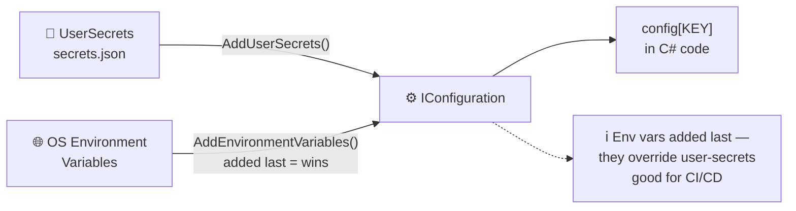
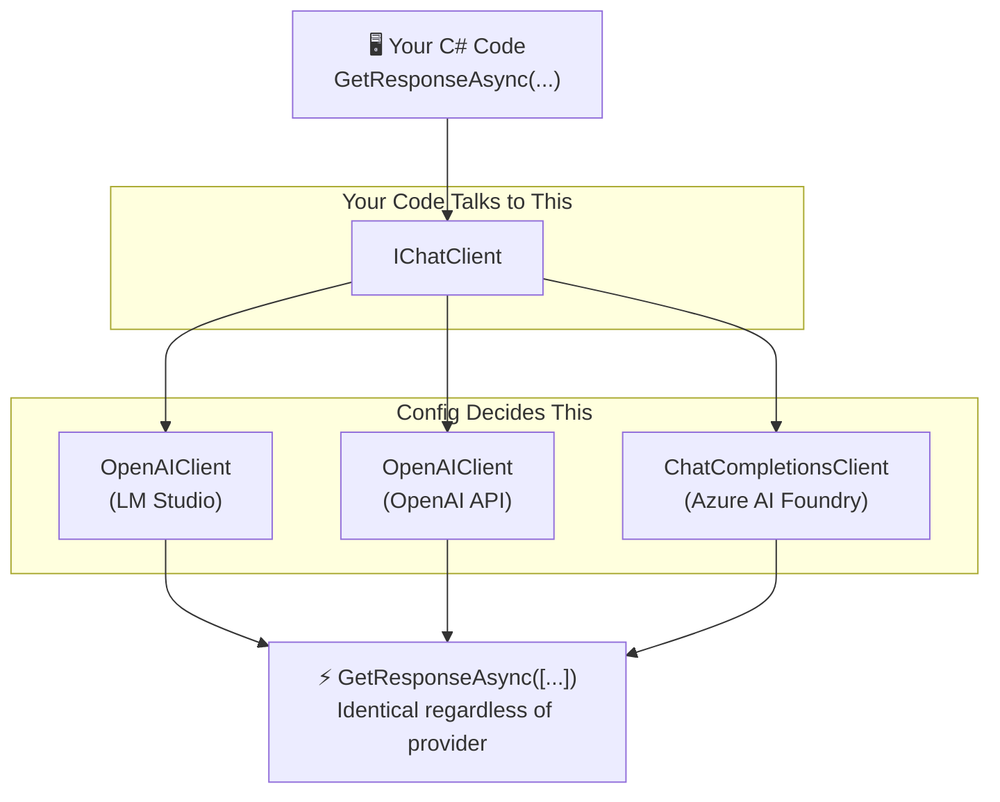

# Chapter 2 — Setting Up Your AI Development Environment

> **What you'll learn:**
> - How to run a local LLM on your own hardware with LM Studio — no cloud account, no API key, no bill
> - How to connect to the OpenAI API and Azure AI Foundry for cloud-backed inference
> - How to create a .NET console app that calls an LLM with `IChatClient.GetResponseAsync()`
> - The provider-switching pattern — one codebase that works against all three backends
> - What "connection refused" and "401 Unauthorized" actually mean and how to fix them before you lose 30 minutes to them

---

## 2.1 What We're Building

This chapter is about getting your hands on a working LLM call. Not a diagram of one. Not a conceptual overview. An actual `dotnet run` that sends a message to an AI model and prints the response.

By the end, you'll have a console app called **HelloAI** that does exactly this — and it'll work with whichever backend you choose:

- **Path A — LM Studio:** runs completely locally, no account needed, costs nothing
- **Path B — OpenAI API:** cloud-hosted GPT models, needs an API key and a small amount of credit
- **Path C — Azure AI Foundry:** Microsoft's enterprise cloud platform, needs an Azure subscription

The code for all three paths is identical from the `GetResponseAsync` call onward. That's the whole point of `IChatClient` — your prompt logic doesn't care which model runs it.

The expected output of the finished app looks like this:

```
Sending your first message to an LLM...

Response:
A delegate in C# is like a variable that stores a method reference rather than a value.
You can pass delegates as parameters, store them in collections, and invoke them later —
making them the foundation for events, callbacks, and LINQ.

✅ If you see a response above, you're good to go. On to Chapter 3!
```

The exact wording of the response will vary — LLMs are not compilers. But if you see text in that space, you're done.

---

## 2.2 Path A: Local with LM Studio (Free)

LM Studio lets you download and run open-source models directly on your machine. No API key, no usage charges, no data sent to the cloud. For learning prompt engineering this is the path that lets you experiment without watching a cost meter.

### Installing LM Studio

Download it from [https://lmstudio.ai](https://lmstudio.ai). It's available for Windows, macOS, and Linux. Install and open it.

LM Studio has two components you need to care about:

1. **The model browser** — where you download models
2. **The local server** — which exposes an OpenAI-compatible API at `/v1`

Both need to be running for the code to work. This is the source of 90% of "why doesn't it connect" moments.

### Picking a Model

Models in LM Studio come as GGUF files. Before you pick one, here's a quick decoder for the naming system you'll see everywhere:

> 📖 **Decoding model filenames**
>
> **What is GGUF?**
> GGUF (GGML Unified Format) is the file format LM Studio uses to store and run LLMs locally. It was created by the [llama.cpp](https://github.com/ggerganov/llama.cpp) project — the open-source C++ runtime that powers local inference tools including LM Studio, Ollama, and Jan.
>
> Before GGUF there was GGML, and before that various ad-hoc formats. GGUF landed in 2023 and became the standard because it:
> - Bundles model weights *and* metadata (tokenizer, architecture config, prompt format) in a single file
> - Supports memory-mapped loading — the OS loads only the parts actively needed, so you can run a model larger than your RAM (slowly) without crashing
> - Is designed for CPU *and* GPU inference — most models run partially on GPU and offload the rest to CPU/RAM automatically
>
> A GGUF file is essentially: *"everything you need to run this model, in one portable binary."* You download it, point LM Studio at it, done. No Python environment, no pip installs, no PyTorch version conflicts.
>
> **Parameters (the B number)**
> The `B` number — `7B`, `13B`, `24B`, `70B` — is the number of *parameters* (weights) in the model, in billions. Think of parameters as the model's "memory of training". More parameters = more knowledge and reasoning ability, but also more RAM and VRAM required.
>
> *Example: Devstral Small 24B has 24 billion parameters. A 24B model at full float32 precision would need ~96 GB of RAM — which is why quantisation exists.*
>
> **Quantisation (the Q number)**
> Quantisation compresses model weights from 32-bit or 16-bit floats down to fewer bits per weight. Less precision = less VRAM = faster inference, at a small accuracy cost.
>
> | Suffix | Bits per weight | VRAM vs full | Quality |
> |---|---|---|---|
> | Q2 | ~2.x bits | ~10% of original | Noticeably degraded — avoid |
> | Q3 | ~3.x bits | ~15% | Usable for simple tasks |
> | Q4 | ~4.5 bits | ~20% | **Sweet spot for most hardware** |
> | Q5 | ~5.5 bits | ~25% | Better quality, modest VRAM cost |
> | Q6 | ~6.5 bits | ~30% | Near full quality |
> | Q8 | ~8 bits | ~40% | Almost identical to full precision |
>
> *Rule of thumb: Q4 for constrained hardware, Q5 or Q6 if you have headroom, Q8 only if VRAM is not a concern.*
>
> **The K, M, L suffixes (K-quants)**
> Modern GGUF files use "k-quants" — a smarter quantisation that applies *different precision to different layers*, keeping important layers (e.g. attention heads) at higher precision while compressing less critical layers more aggressively.
>
> | Suffix | Meaning | When to use |
> |---|---|---|
> | `_K_S` | K-quant, **S**mall — more aggressive compression | Very tight VRAM budget |
> | `_K_M` | K-quant, **M**edium — balanced compression | Default choice; best quality/size ratio |
> | `_K_L` | K-quant, **L**arge — less compression, higher quality | Plenty of VRAM, want best quality at this bit depth |
>
> *Example: `Q4_K_M` = 4-bit k-quant medium. Generally the recommended pick for Q4 models. `Q4_K_L` gives slightly better quality but is ~10% larger.*
>
> **Putting it together**
> `Devstral-Small-24B-Q4_K_M.gguf` means:
> - 24 billion parameters
> - Quantised to 4-bit k-quant, medium variant
> - Needs approximately **14–16 GB of VRAM** (24B × ~0.6 GB/B at Q4_K_M)
> - Stored as a GGUF file, ready for LM Studio

Pick based on how much VRAM your GPU has:

| VRAM | Recommended model | Why |
|---|---|---|
| 4 GB | Phi-4 Mini (`microsoft/phi-4-mini-reasoning`) | Microsoft's compact model; surprisingly capable for its size |
| 8 GB | Llama 3.1 8B or Mistral 7B | Well-balanced; good instruction-following |
| 16 GB+ | Llama 3.1 13B or Qwen2.5-14B (Q4) | Strong quality; fits comfortably with KV-cache headroom |
| 24 GB+ | Llama 3.1 70B (quantised Q4) | Near GPT-4 quality — but needs ~40 GB VRAM at Q4 |
| CPU only | Phi-4 Mini Q4 | Slow but functional; expect 2–5 tokens/second |

> ⚠️ **Llama 3.1 70B Q4 requires approximately 40 GB of VRAM** — not 16 GB. On hardware with less, LM Studio will either refuse to load it or page to system RAM, making inference impractically slow.

Search for your chosen model in LM Studio's discovery panel and download it. This can take a while — Llama 3.1 8B is around 5 GB.

### Starting the Local Server

In LM Studio, go to **Local Server** (the icon looks like terminal 🖥️ in the left sidebar, depending on which version you have installed). Load the model you downloaded, then click **Start Server**, which can be next to the Status toggle button. (If it runs it will turn green).

The server binds to port **1234** by default and exposes an OpenAI-compatible REST API at `http://localhost:1234/v1`.

> ⚠️ **Two things must both be true for the server to work:**
> 1. The server must be running (the status indicator is green)
> 2. A model must be loaded (the model name is shown in the server panel)
>
> If either is missing, you'll get "connection refused" when you run the code. The server won't accept requests until a model is loaded, even if it shows as started.

### Finding the Exact Model ID

This is the bit that catches people out. The model ID you pass to the `GetChatClient()` call must match *exactly* what LM Studio reports — not what you typed in the search, not the filename, the ID the server exposes.

To find it, make this request while the server is running:

```
GET http://localhost:1234/v1/models
```

You can do this in a browser, curl, or any HTTP client. The response looks like:

```json
{
  "data": [
    {
      "id": "microsoft/phi-4-mini-reasoning",
      "object": "model",
      ...
    }
  ]
}
```

Use the `"id"` value. That exact string goes into your `GetChatClient()` call. If you see `microsoft/phi-4-mini-reasoning`, that's what you pass. If it says something different, use that instead.

> 💡 **Why OpenAI client, not Ollama?**
> LM Studio exposes an OpenAI-compatible API — it speaks the same HTTP protocol as `api.openai.com`. That means you use `OpenAIClient` pointed at your local endpoint, not `OllamaChatClient`. Ollama is a different tool with a different API. If you've used Ollama before, note that it runs on port **11434** — LM Studio runs on **1234**. Different tool, different port.

---

## 2.3 Path B: OpenAI API

If you don't want to deal with local hardware or the model is too large for your machine, OpenAI's API is the fastest path to a working setup.

### Getting an API Key

Go to [https://platform.openai.com](https://platform.openai.com) and create an account. Under **API Keys**, generate a new key. It starts with `sk-`.

Add some credit to your account (a few dollars is plenty for learning — `gpt-4o-mini` costs fractions of a cent per request).

### Storing the Key Safely

Never put an API key in source code. Use .NET's user-secrets instead:

```bash
dotnet user-secrets set "OPENAI_API_KEY" "sk-your-key-here"
```

This stores the key in your user profile, outside the project directory, outside git.

> ⚠️ **`dotnet user-secrets` and `Environment.GetEnvironmentVariable()` are different things.** User-secrets are stored in a JSON file and surfaced via `IConfiguration` — not as OS environment variables. The `Program.cs` in this chapter uses `IConfiguration` to read them. You don't need to do anything extra — just run `dotnet user-secrets set` and the code handles the rest.



### Which Model to Use

Use `gpt-4o-mini` for this book. It's cheap, fast, and capable enough for everything you'll do here. `gpt-4o` is more powerful but costs roughly 15× more per token — you don't need it while learning.

> 📝 **On pricing and rate limits:**
> OpenAI charges per token — roughly $0.15 per million input tokens for `gpt-4o-mini`. For the examples in this book, you'll spend a few cents total. Rate limits on new accounts are conservative; if you hit a 429, wait a moment and retry. Chapter 6 covers resilience patterns for production.

---

## 2.4 Path C: Azure AI Foundry

Azure AI Foundry is Microsoft's cloud platform for deploying, monitoring, and governing AI models at scale. For the purpose of this chapter, "at scale" means you're connecting to a GPT-4o model hosted in Azure rather than on OpenAI's infrastructure directly. Same family of models, different billing relationship and different endpoint URL.

You'd choose this path if:
- Your organisation has Azure credits or an Enterprise Agreement
- You need models to run within a specific Azure region for compliance
- You're eventually heading toward Azure AI Foundry's monitoring, evaluation, or PromptOps features

### Setting Up

1. In the [Azure portal](https://portal.azure.com), search for **Azure AI Foundry** and create a new hub and visit foundry page.
2. Within that hub, create a **project** (I didn't add the UI becasue currently there are 2 portals New vs Old, pick the one that is intuitive to you)
3. In the project, go to **Deployments** and deploy a model — GPT-4o-mini is the recommended choice due to price, but feel free to deploy a different model
4. Copy the **Endpoint URL** and **Key** from the deployment page or use the Managed Identities if your policy requires you. 

Store them as user-secrets:

```bash
dotnet user-secrets set "AZURE_AI_ENDPOINT" "https://your-resource.services.ai.azure.com/models"
dotnet user-secrets set "AZURE_AI_KEY" "your-key-here"
```

> ⚠️ **The endpoint URL matters.** Azure AI Foundry endpoints follow a specific format. Make sure you copy the URL from the deployment page — not the hub page, not the project page, the *deployment* page. Using the wrong URL is the most common cause of `ResourceNotFound` errors.

---

## 2.5 Setting Up the .NET Project

Time to write code. Create the project:

```bash
dotnet new console -n HelloAI
cd HelloAI
dotnet user-secrets init
```

### Adding the NuGet Packages

Edit `HelloAI.csproj` and add these package references inside the `<ItemGroup>`:

```xml
<PackageReference Include="Microsoft.Extensions.AI" Version="*-*" />
<PackageReference Include="Microsoft.Extensions.AI.OpenAI" Version="*-*" />
<PackageReference Include="Microsoft.Extensions.AI.AzureAIInference" Version="*-*" />
<PackageReference Include="Azure.AI.Inference" Version="*-*" />
```

Then restore:

```bash
dotnet restore
```

### Why `*-*`?

The `*-*` version pattern tells NuGet "give me the latest prerelease version." Microsoft.Extensions.AI is still in preview — stable 1.0 releases haven't shipped yet. These packages move fast and the preview versions contain features and fixes that matter for this book.

Using `*-*` is a deliberate choice for learning, not a production recommendation. For a production application you'd pin to a specific version after testing. For this book, you want the current behaviour.

> 💡 **If you get a "no packages found" error**, make sure NuGet.org is in your package sources and that prerelease packages are allowed. In Visual Studio, check "Include prerelease" in the package manager. From the CLI, `dotnet restore` picks up prerelease automatically when the version range includes `-*`.

---

## 2.6 The Provider-Switching Pattern

Here's the core architectural idea behind all the code in this book: **`IChatClient` is the only thing your prompting code ever touches.**

Think of it like `IDbConnection` in ADO.NET. You write SQL against the interface. Whether that connection is backed by SQL Server, PostgreSQL, or SQLite is configured elsewhere — your query logic doesn't change. `IChatClient` works the same way. Your prompt, your message list, your call to `GetResponseAsync()` — none of that changes when you switch from LM Studio to OpenAI to Azure.

What does change is the three or four lines that construct the client. You configure those once, at the top of the app or in a DI registration, and the rest of the code is identical.



### The Full Program.cs

Open `Program.cs` and replace its contents with this:

```csharp
// HelloAI — Chapter 2
// One codebase, three AI backends. Choose your path, comment out the others.
// ─────────────────────────────────────────────────────────────────────────

using Microsoft.Extensions.AI;
using OpenAI;
using System.ClientModel;

// ─────────────────────────────────────────────────────────────────
// OPTION A: Local (Free) — LM Studio
// ─────────────────────────────────────────────────────────────────
// 1. Download LM Studio from https://lmstudio.ai
// 2. Download a model (Phi-4 Mini recommended for 4GB VRAM)
// 3. Go to Local Server, load the model, click Start Server
// 4. Run GET http://localhost:5000/v1/models to find the exact model id
//
// LM Studio exposes an OpenAI-compatible API at /v1 (NOT Ollama-compatible).
// The API key is ignored by LM Studio; the SDK requires a non-empty value.
// ─────────────────────────────────────────────────────────────────
IChatClient client = new OpenAIClient(
        new ApiKeyCredential("lm-studio"),                // value is ignored by LM Studio
        new OpenAIClientOptions { Endpoint = new Uri("http://localhost:5000/v1") })
    .GetChatClient("microsoft/phi-4-mini-reasoning")      // must match GET /v1/models exactly
    .AsIChatClient();

// ─────────────────────────────────────────────────────────────────
// OPTION B: OpenAI API
// ─────────────────────────────────────────────────────────────────
// dotnet user-secrets set "OPENAI_API_KEY" "sk-..."
// ─────────────────────────────────────────────────────────────────
// IChatClient client = new OpenAIClient(
//         Environment.GetEnvironmentVariable("OPENAI_API_KEY")
//             ?? throw new InvalidOperationException("Set OPENAI_API_KEY in user-secrets"))
//     .GetChatClient("gpt-4o-mini")
//     .AsIChatClient();

// ─────────────────────────────────────────────────────────────────
// OPTION C: Azure AI Foundry
// ─────────────────────────────────────────────────────────────────
// dotnet user-secrets set "AZURE_AI_ENDPOINT" "https://your-resource.services.ai.azure.com/models"
// dotnet user-secrets set "AZURE_AI_KEY" "your-key-here"
// ─────────────────────────────────────────────────────────────────
// IChatClient client = new Azure.AI.Inference.ChatCompletionsClient(
//         new Uri(Environment.GetEnvironmentVariable("AZURE_AI_ENDPOINT")
//             ?? throw new InvalidOperationException("Set AZURE_AI_ENDPOINT in user-secrets")),
//         new Azure.AzureKeyCredential(
//             Environment.GetEnvironmentVariable("AZURE_AI_KEY")
//             ?? throw new InvalidOperationException("Set AZURE_AI_KEY in user-secrets")))
//     .AsChatClient("gpt-4o");

// ─────────────────────────────────────────────────────────────────
// The call — identical for all three providers.
//
// GetResponseAsync is the MEAI 10+ name (was CompleteAsync in 9.x).
// ChatMessage takes a role and a string. ChatRole.User is your message.
// response.Text is the convenience shortcut on ChatResponse.
// ─────────────────────────────────────────────────────────────────
Console.WriteLine("Sending your first message to an LLM...\n");

var response = await client.GetResponseAsync(
    [new ChatMessage(ChatRole.User,
        "Explain what a delegate is in C# in two sentences, like I'm a junior developer.")]);

Console.WriteLine("Response:");
Console.WriteLine(response.Text);

Console.WriteLine("\n✅ If you see a response above, you're good to go. On to Chapter 3!");
```

### What `IChatClient` Actually Does

`IChatClient` is the core abstraction in Microsoft.Extensions.AI (MEAI). It has one primary method:

```csharp
Task<ChatResponse> GetResponseAsync(
    IEnumerable<ChatMessage> messages,
    ChatOptions? options = null,
    CancellationToken cancellationToken = default);
```

You send it a list of `ChatMessage` objects. Each message has a `ChatRole` — `User` for your input, `System` for instructions, `Assistant` for previous model responses. You get back a `ChatResponse`. The `response.Text` property is a convenience shortcut that returns the content of the first assistant message as a string.

The concrete implementations — `OpenAIClient`, `ChatCompletionsClient` — each wrap their provider's SDK and translate `IChatClient` calls into the right HTTP requests. Your code never sees the wire format.

> 📝 **Version note:** In MEAI 9.x, the method was `CompleteAsync` and returned `ChatCompletion`. In MEAI 10+, it's `GetResponseAsync` returning `ChatResponse`. If you're reading older samples online and they use `CompleteAsync`, that's why they look different. Use `GetResponseAsync` — it's the current API.

### `AsIChatClient()` and `.GetChatClient()`

Two small method calls do the translation work:

- `.GetChatClient("model-name")` — on `OpenAIClient`, this returns an `OpenAI.Chat.ChatClient` scoped to a specific model
- `.AsIChatClient()` — this is an extension method from `Microsoft.Extensions.AI.OpenAI` that wraps the provider-specific client in the `IChatClient` interface

For Azure, `ChatCompletionsClient.AsChatClient("model-name")` does both steps at once. The Azure AI Inference SDK has its own extension method from `Microsoft.Extensions.AI.AzureAIInference`.

---

## 2.7 Running HelloAI

Make sure you've chosen one option in `Program.cs` (uncomment Option A, B, or C — one at a time), then:

```bash
dotnet run
```

### Expected Output

For any provider that's working, you'll see something like:

```
Sending your first message to an LLM...

Response:
A delegate in C# is like a variable that stores a method reference rather than a value.
You can pass delegates as parameters, store them in collections, and invoke them later —
making them the foundation for events, callbacks, and LINQ.

✅ If you see a response above, you're good to go. On to Chapter 3!
```

The model's exact wording will differ. That's normal — it's a language model, not a lookup table.

### Troubleshooting

Three failures happen consistently, each with a clear cause:

**"Connection refused" (LM Studio / Option A)**

The server isn't responding. Check both of these:
1. Is LM Studio's local server running? (green status indicator)
2. Is a model loaded in the server panel? (the model name appears)

Both must be true. Starting the server without loading a model causes exactly this error. Load a model first, then start the server (or reload after loading).

**"401 Unauthorized" (OpenAI / Option B)**

The API key is wrong, missing, or the account has no credit. Verify:
- `dotnet user-secrets list` shows `OPENAI_API_KEY` with the right value
- The key on platform.openai.com is active (not expired or revoked)
- Your account has a positive credit balance

**"ResourceNotFound" or "404" (Azure / Option C)**

The endpoint URL is wrong. This is almost always a URL format issue:
- Go back to the deployment page in Azure AI Foundry (not the hub, not the project — the *deployment*)
- Copy the endpoint URL shown there
- Make sure it ends in `/models` if you're using the Azure AI Inference client

> ⚠️ If you see a `TaskCanceledException` or timeout instead of one of the above, check that you're not behind a corporate proxy that's intercepting HTTPS. LM Studio also occasionally takes 20–30 seconds to generate the first token on a cold load — that's not a bug, it's the model warming up.

---

## 2.8 Practical: HelloAI — Your First LLM Call

**What you're building:** A console app that sends a message to an LLM and prints the response.

**Goal:** Get a response from at least one provider. You don't need all three working — one is enough to confirm your setup.

**Where the code lives:** `chapter-02/src/HelloAI/`

### Steps

1. Follow Section 2.5 to create the project and add the packages
2. Choose your provider (Path A, B, or C) and set it up per the relevant section above
3. Copy the `Program.cs` from Section 2.6 (or use the repo's `chapter-02/src/HelloAI/Program.cs`)
4. Uncomment your chosen option, make sure the model ID or API key is correct
5. Run `dotnet run`

### Expected Output

```
Sending your first message to an LLM...

Response:
A delegate in C# is like a variable that stores a method reference rather than a value...

✅ If you see a response above, you're good to go. On to Chapter 3!
```

### Stretch Goals

- Try switching providers without touching the `GetResponseAsync` call. Just swap which `IChatClient client = ...` block is active. Notice that the prompt code doesn't change at all.
- Change the question in the `ChatMessage`. Ask the model to explain `async/await` instead. Does the response format change when you ask differently?
- Add a second `Console.WriteLine` that prints `response.Usage?.InputTokenCount` and `response.Usage?.OutputTokenCount`. Token counts are where cost comes from — get comfortable seeing them.

---

## Chapter Summary

| Topic | What you now know |
|---|---|
| LM Studio | OpenAI-compatible API on port 5000; use `OpenAIClient` not `OllamaChatClient`; get model ID from `GET /v1/models` |
| OpenAI | Store key in user-secrets; use `gpt-4o-mini` for learning |
| Azure AI Foundry | Create hub → project → deployment; endpoint URL comes from the deployment page |
| .NET project setup | `Microsoft.Extensions.AI` + provider packages; `Version="*-*"` for latest prerelease |
| `IChatClient` | The provider-independent interface; `GetResponseAsync` in MEAI 10+; `response.Text` for the result |
| Provider-switching | Three construction patterns at the top; identical call code below |

---

## Up Next:

Chapter 3 is where the model stops being a black box. You'll learn how LLMs actually process text (tokens, not characters), why the context window is a hard ceiling not a soft guideline, and what temperature and Top-P do to your outputs. That knowledge turns prompt engineering from guesswork into something closer to a discipline.

---

← [Chapter 1 — The .NET Developer's AI Landscape](../chapter-01/chapter-01-the-dotnet-developers-ai-landscape.md) | [Chapter 3 — How LLMs Work (Just Enough Theory)](../chapter-03/) →
