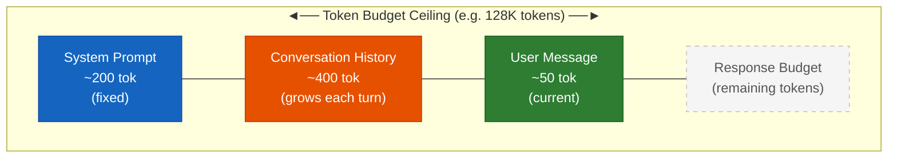

# Chapter 3 — How LLMs Work (Just Enough Theory)

> **What you'll learn:**
> - What tokens are, why they're the unit everything else is measured in, and how to estimate them without a PhD
> - How the context window works — and what happens (silently) when you overflow it
> - What temperature and sampling actually do, and which settings to use for code vs. prose
> - The three chat message roles (`System`, `User`, `Assistant`) and how they map to .NET types
> - Which parameters in `ChatOptions` are worth touching, and which you can leave alone

---

## 3.1 Why This Chapter Exists (and What It Deliberately Skips)

You already have a working `GetResponseAsync()` call from Chapter 2. You can send a message to an LLM and get a response back. That's the what. This chapter is the *why* — and it's going to stay practical.

Here's the analogy: you don't need to understand internal combustion to drive a car. But knowing that an engine needs fuel and oxygen makes you much better at diagnosing why it won't start. Is it out of petrol? Is something blocking the air intake? Without that mental model, you're reduced to random fiddling and hoping.

The same applies to LLMs. You don't need to know about transformer attention heads, softmax distributions, or gradient descent to write good prompts. But you do need to understand tokens, context windows, and temperature — because these are the "fuel and oxygen" of every LLM call you'll ever make.

**What this chapter is NOT:**

- A transformer architecture walkthrough
- An explanation of attention mechanisms
- A training pipeline tutorial
- A fine-tuning guide
- A maths-heavy deep-dive into probability distributions

If you want those things, Andrej Karpathy's YouTube channel is excellent. That's not this book.

**What this chapter IS:**

The minimum viable theory that makes Chapters 4–7 make sense. By the end, you'll understand why your prompt structure matters, why temperature needs to be different for code vs. creative tasks, and why "the model forgot what I said earlier" is a feature, not a bug (a frustrating one, but a feature).

Let's start with the one concept that underpins everything else.

---

## 3.2 Tokens: The Currency of LLMs

Before you write a single prompt, you need to understand what an LLM actually reads. Not words. Not characters. **Tokens.**

### What a token is

A token is the basic unit of text that an LLM processes. Roughly speaking, a token is a word fragment — typically around 4 characters in common English text. The tokenizer (the component that converts raw text into tokens) splits text using a vocabulary of tens of thousands of sub-word fragments, chosen to balance coverage and efficiency.

Tokens are not:
- Characters (too granular — a 10-character word might be 2–3 tokens)
- Words (too coarse — a rare or compound word might be 4+ tokens)

Here's what real tokenisation looks like for some developer-friendly strings:

| Text | Approximate token count | Why |
|---|---|---|
| `"Hello"` | 1 token | Common, short, dictionary word |
| `"GetResponseAsync"` | 3–4 tokens | Split at case boundaries roughly: `Get`, `Response`, `Async` |
| `"Microsoft.Extensions.AI"` | 5–6 tokens | Dots and namespace segments each cost tokens |
| `"supercalifragilistic"` | 4–5 tokens | Rare word, decomposed into fragments |
| `"NullReferenceException"` | 4–5 tokens | `Null`, `Reference`, `Exception` — each a known fragment |

> 💡 **The practical rule:** 1 token ≈ 0.75 words, or equivalently 1 word ≈ 1.33 tokens. For quick estimates: take your word count and multiply by 1.33. A 500-word document ≈ 665 tokens. A 1,000-word system prompt ≈ 1,330 tokens.

### Why tokens matter for cost

Every cloud LLM API charges per token — both input (what you send) and output (what the model generates). OpenAI, Azure OpenAI, Anthropic, and others all bill this way. The exact rates vary by model and change over time, but the billing unit is always tokens.

A rough worked example:

```text
System prompt:        ~200 words  → ~266 tokens
Your user message:    ~50 words   → ~67 tokens
Model response:       ~300 words  → ~400 tokens

Total per call: ~733 tokens
```

Cloud providers charge input and output tokens at different rates — typically output is 4–8× more expensive than input. Check your provider's current pricing page for exact figures (rates change frequently). With GPT-4o-class models, expect a few thousandths of a cent for a simple Q&A call — but costs compound fast once you add long system prompts, conversation history, or retrieved documents.

With LM Studio locally, you pay in electricity and GPU time. But you still need to understand tokens because of the other reason they matter:

### Why tokens matter for context limits

Every model has a **context window** — the maximum number of tokens it can process in a single call (input + output combined). This is a hard limit, not a suggestion. Common sizes:

| Context window | Typical model examples |
|---|---|
| 4K–8K tokens   | GPT-3.5-turbo (original), GPT-4 base (8K), smaller local models |
| 16K–32K tokens | GPT-3.5-turbo-16k, Mistral 7B, many mid-range open-source models |
| 128K tokens    | GPT-4o, many modern frontier models |
| 1M+ tokens     | Gemini 1.5 Pro (outlier, but it exists) |

When you hit the limit, one of two things happens — and neither is great:
1. The API returns an error (the better outcome — at least you know)
2. The model silently truncates the earliest messages and continues (the worse outcome — you don't know)

We'll explore context windows properly in Section 3.3.

### Counting tokens in C#

If you need exact token counts in C#, the `TiktokenSharp` NuGet package implements OpenAI's tokenisation algorithm. It's useful for building systems that need to stay within budgets, but it's a tangent for now. The `word × 1.33` estimate is good enough for everything in this book.

```csharp
// TiktokenSharp — for when you need exact counts, not estimates
// var encoding = TiktokenSharp.TikToken.EncodingForModel("gpt-4o");
// var tokenCount = encoding.Encode(myText).Count;
```

---

## 3.3 The Context Window: Your Model's Working Memory

Here's the .NET analogy that makes context windows click immediately:

**The context window is like a method's stack frame.** It contains everything the current invocation knows about. When the method returns (the response arrives), that stack frame is gone. The next call starts fresh. There is no persistent state between calls — no heap, no static variables, no database — unless you explicitly pass that information in as a parameter.

A C# method doesn't "remember" what happened last time you called it (unless you pass the previous state as an argument). An LLM call doesn't "remember" your previous conversation (unless you include that conversation in the messages list).

This is the single most common source of confusion for developers new to LLMs. "It forgot what I said three messages ago." Yes. Because you didn't include those messages in the current call. Let's look at what actually goes into the context window.

### What fills the context window

Every token in all of the following counts against your limit:

```text
┌─────────────────────────────────────────────────────────────┐
│  Context Window  (e.g. 128K tokens)                         │
│                                                             │
│  ┌───────────────────┐                                      │
│  │   System Prompt   │  ← Your instructions, persona, rules │
│  ├───────────────────┤                                      │
│  │  User message 1   │  ← Conversation history             │
│  │  Assistant msg 1  │                                      │
│  │  User message 2   │                                      │
│  │  Assistant msg 2  │                                      │
│  │  ...              │                                      │
│  ├───────────────────┤                                      │
│  │  Current user msg │  ← Your new prompt                  │
│  ├───────────────────┤                                      │
│  │  [Model response] │  ← Output also consumes tokens       │
│  └───────────────────┘                                      │
└─────────────────────────────────────────────────────────────┘
```



> _See [rendered PNG](images/context-window-light.png) for a colour-coded version. As conversation history grows, the Response Budget shrinks — until the API errors or silently drops the oldest messages._

A bloated system prompt is a hidden tax on every call. If your system prompt is 2,000 tokens (roughly 1,500 words — not unreasonable for a detailed set of instructions), you're spending 2,000 tokens before the user says anything, on every single call.

### Stateless by default

Because there's no persistent state, building a chat interface requires you to explicitly maintain and re-send conversation history:

```csharp
// You own the conversation history — the model doesn't
var messages = new List<ChatMessage>
{
    new(ChatRole.System, "You are a helpful C# code assistant."),
    new(ChatRole.User, "What is the difference between a struct and a class?"),
    new(ChatRole.Assistant, "The key differences are..."), // previous response
    new(ChatRole.User, "Can you show me an example of each?"),  // new message
};

// The model now has the full conversation — it can refer back to the first question
var response = await client.GetResponseAsync(messages);
```

In a real chat application, you'd append each new user message and each new assistant response to this list, then send the full list every time. The model isn't keeping a transcript — you are.

### The "lost in the middle" problem

There's a nuance worth knowing before you build anything with large contexts: models are better at attending to content near the **beginning** and **end** of the context window. Content buried deep in the middle — say, message 15 of 40 — is statistically less likely to influence the response, even if it's technically within the window.

This is known as the "lost in the middle" problem, documented in several published papers. It's relevant when you start feeding large retrieved documents into the context — if you fetched ten documents and concatenated them, the model may effectively ignore the ones in the middle.

The practical upshot for now: **important instructions belong at the beginning (system prompt) or at the very end (just before the current user message).** Don't bury critical context in the middle of a long conversation history and wonder why the model isn't following it.

### The silent truncation problem

> ⚠️ **Watch out:** "My chat app stopped remembering the start of our conversation after a while."

This is the context window limit in action. Some APIs silently drop the oldest messages when the limit is approached. No exception. No warning. The model starts responding as if the earlier conversation never happened — because from its perspective, it didn't.

The defensive approach is to track your token budget explicitly and summarise or truncate conversation history before sending it. We'll revisit this in later chapters. For now, just know it can happen.

---

## 3.4 Temperature and Sampling: Controlling Randomness

This is the parameter every developer touches first, often without understanding what it actually does.

**Sampling** is how the model picks its next token. Rather than always choosing the single most likely word, it draws probabilistically from a ranked list — giving less-likely tokens a chance to be selected. Temperature and Top-P both control how that draw is weighted.

### What temperature is

When the model generates a response, it doesn't just deterministically output the single most likely next word. Internally, it computes a probability distribution over its entire vocabulary — every token it could possibly produce next, each with an associated probability score. Then it *samples* from that distribution.

**Temperature is a multiplier on that distribution.**

- **Low temperature** (approaching 0) sharpens the distribution — the highest-probability tokens get even higher relative probability, the rest get squashed. The model becomes more likely to pick the "obvious" next token.
- **High temperature** (approaching 2.0) flattens the distribution — probabilities spread out, and lower-probability tokens get a real chance of being selected. The model becomes more likely to pick something surprising.

The keyboard autocomplete analogy makes this concrete: imagine your phone's autocomplete suggesting the next word.

```mermaid
xychart-beta
    title "Token-Selection Probability by Temperature"
    x-axis ["Top token", "2nd", "3rd", "4th", "5th", "6th"]
    y-axis "Relative probability (%)" 0 --> 100
    bar [95, 3, 1, 0.5, 0.3, 0.1]
    bar [55, 22, 12, 6, 3, 2]
    bar [25, 21, 18, 15, 12, 9]
```



> _Three bar series in order: **T = 0** (near-deterministic) · **T = 0.7** (balanced) · **T = 1.5** (creative). See [rendered PNG](images/temperature-distribution-light.png)._

- **T = 0:** always picks the single top suggestion. Predictable, boring, factually reliable.
- **T = 0.7:** usually picks from the top few suggestions, occasionally picks something in the top 10. Natural-feeling, coherent.
- **T = 1.5:** starts suggesting words that technically fit but feel off. Things get weird.
- **T = 2.0:** your phone is now autocompleting based on a dictionary fed into a blender.

### The practical temperature guide

| Use case | Recommended temperature | Why |
|---|---|---|
| Code generation | 0–0.2 | You want the correct answer, not a creative interpretation of a sort algorithm |
| Classification / labelling | 0 | Categorise this as A, B, or C — pick one |
| Factual Q&A | 0–0.3 | You want facts, not creative elaborations |
| Summarisation | 0.3–0.5 | Accurate content, with some flexibility in phrasing |
| Prose / documentation writing | 0.6–0.8 | Readable, natural, not robotic |
| Creative writing / brainstorming | 0.8–1.0 | Variety and surprise are the point |
| T > 1.0 | Rarely useful | Can produce incoherent or grammatically broken output |

> 📝 **Honest note:** Temperature 0 is "near-deterministic" — not fully. Due to floating-point rounding differences across hardware, CUDA kernels, and batching strategies on the provider's servers, the same model at T=0 may give slightly different outputs across calls. For practical purposes, treat it as deterministic. For production systems where reproducibility is critical, you'll want to evaluate carefully.

### Setting temperature in code

In Microsoft.Extensions.AI (MEAI), temperature and other generation parameters live in `ChatOptions`. `MaxOutputTokens` puts a hard ceiling on how many tokens the model can emit in a single response — useful for keeping costs predictable and responses concise.

```csharp
var options = new ChatOptions
{
    Temperature = 0.7f,    // float, not double
    MaxOutputTokens = 500  // hard ceiling — the model stops mid-sentence if it hits this
};

var response = await client.GetResponseAsync(messages, options);
```

`ChatOptions` is passed as the second argument to `GetResponseAsync`. If you omit it, the provider uses its own defaults (usually around 0.7–1.0).

### Top-P (nucleus sampling)

You may see a `TopP` parameter alongside temperature. Here's the short version: top-P is an alternative way to control randomness.

Instead of scaling the entire distribution, top-P says: "only sample from the smallest set of tokens that together account for P% of the total probability mass." With `top_p = 0.9`, the model ignores the long tail of unlikely tokens and samples only from the tokens that make up the top 90% of probability — effectively cutting off the weird stuff at the bottom.

**For the purposes of this book:** leave `TopP` at its default (usually 1.0 or 0.95). Temperature is the lever you'll actually use. You only need both when you want very fine-grained control, and reaching for both at once tends to produce unexpected interactions.

---

## 3.5 The Chat Message Structure

The role you assign to each message shapes how the model weights it. Getting this right — especially the distinction between System and User — is one of the highest-leverage things you'll do in prompt engineering, because a single well-written system prompt replaces boilerplate instructions in every subsequent user message.

Every call to `GetResponseAsync` takes a list of `ChatMessage` objects. Each message has a role. There are three roles, and they're not interchangeable.

### The three roles

**`ChatRole.System`**

The system message is a set of instructions the model treats as its operating context. It's processed before every user message and shapes how the model interprets and responds to everything that follows. It's not shown to the end user — it's the backstage setup.

Use the system prompt to define:
- Persona: "You are a senior C# code reviewer with a preference for clean, readable code."
- Rules: "Never suggest adding `Thread.Sleep`. Prefer async alternatives."
- Format: "Always respond with a numbered list of issues. Max 5 issues per response."
- Context: "The codebase uses .NET 9 with nullable reference types enabled."

**`ChatRole.User`**

The user message is the human's turn in the conversation. Your actual prompt goes here — the question, the instruction, the code to review, the document to summarise. This is what the model primarily responds to.

**`ChatRole.Assistant`**

The assistant message represents a previous response from the model. You include these when you're building a multi-turn conversation and you want the model to have continuity — to be able to refer back to what it said previously.

### The .NET constructor/method/return-value analogy

If you're wiring this into your mental model:

- **System** = constructor injection. It sets up the object's behaviour and constraints for the lifetime of the interaction.
- **User** = method call. The actual request being made right now.
- **Assistant** = return value from a previous call. You're passing it back to provide continuity.

### What this looks like in code

```csharp
var messages = new List<ChatMessage>
{
    // System: sets the persona and rules once, for the whole conversation
    new(ChatRole.System, "You are a C# code reviewer. Be concise. Focus on correctness and readability. Do not comment on style unless it affects clarity."),

    // User: first question
    new(ChatRole.User, "Review this method: public int Add(int a, int b) => a + b;"),

    // Assistant: the model's previous response (you'd have stored this from the last call)
    new(ChatRole.Assistant, "The method is correct and idiomatic. No issues. Consider whether it belongs on a static utility class or an instance method depending on your design."),

    // User: follow-up question — the model can now refer to its previous response
    new(ChatRole.User, "Should I add a checked keyword to prevent overflow?"),
};

var response = await client.GetResponseAsync(messages);
```

The model sees the full conversation. It knows it already reviewed the method and gave an assessment. The follow-up makes sense in context. Without the assistant message, the model would be reading the follow-up question with no idea what method you're talking about.

In a real app, you build this list dynamically by capturing each response and appending it:

```csharp
// Capture the first response and add it so the model remembers what it said
var firstResponse = await client.GetResponseAsync(messages);
messages.Add(new ChatMessage(ChatRole.Assistant, firstResponse.Text ?? ""));
messages.Add(new ChatMessage(ChatRole.User, "Should I add a checked keyword to prevent overflow?"));
var secondResponse = await client.GetResponseAsync(messages);
// This pattern — append → ask → append → ask — is the core loop of every LLM chat app
```

### Why system prompts do the heavy lifting

A well-crafted system prompt reduces how much you need to include in every user message. Compare these two approaches:

```text
❌ User message doing all the work:
"Review the following C# method for correctness, readability,
 and whether it handles null inputs. Be concise. Don't talk
 about style. The codebase is .NET 9. The team prefers early
 returns over nested conditions. Method: [code here]"

✅ System prompt doing the setup, user message doing the ask:
System: "You are a C# code reviewer for a .NET 9 codebase. Be concise.
         Focus on correctness and null safety. Prefer early-return feedback.
         Do not comment on style."
User:   "Review this method: [code here]"
```

The second approach means you can send dozens of code snippets with a single-line user message each, and the model's behaviour stays consistent across all of them. The system prompt runs once per chat session, not once per message.

---

## 3.6 Other Parameters Worth Knowing

`ChatOptions` in MEAI has several other properties. Most of the time you'll ignore them. Here's when you won't:

| Parameter | What it does | When to touch it |
|---|---|---|
| `Temperature` | Scales the probability distribution. 0 = near-deterministic, 1 = default sampling | Set to 0 for code/classification; 0.7 for prose |
| `MaxOutputTokens` | Hard cap on response length in tokens | When you need short responses (e.g., classification labels) or want cost control |
| `StopSequences` | Stops generation when any of these strings is encountered | Structured output: stop at `}` for JSON blocks, `.` for single-sentence answers |
| `TopP` | Nucleus sampling threshold — ignores tokens outside the top P% of probability mass | Rarely needed. Leave at default. |
| `FrequencyPenalty` | Penalises tokens proportional to how often they've already appeared in the response | Reduces repetitive sentence structures in long prose generation |
| `PresencePenalty` | Penalises tokens that have appeared at all in the response (binary, not proportional) | Encourages broader vocabulary, avoids the model using the same words repeatedly |

All of these are properties on `ChatOptions` and map cleanly to the underlying API parameters:

```csharp
var options = new ChatOptions
{
    Temperature = 0f,                           // code generation — near-deterministic
    MaxOutputTokens = 100,                      // short classification response
    StopSequences = ["}"],                      // stop at end of a JSON object
    FrequencyPenalty = 0.3f,                    // reduce repetition in prose
    // TopP = 0.95f,                            // usually leave this alone
    // PresencePenalty = 0.2f,                  // slightly encourage vocabulary variety
};
```

> 💡 **The 90% rule:** For everything in this book, you'll use `Temperature`, `MaxOutputTokens`, and occasionally `StopSequences`. The penalty parameters become relevant when you're generating long-form content and notice the model starting to sound like a broken record.

---

## 3.7 Why the Same Prompt Gives Different Results

You write a prompt. It works great. You run it again. The output is different. You run it a third time. Different again. What's going on?

Three things contribute to this, and they compound each other.

### 1. Temperature introduces sampling randomness

Any temperature above 0 means the model is sampling from a probability distribution, not reading from a lookup table. Two calls with the same input and T=0.7 will almost always produce different outputs — that's by design. The model explores the space of plausible completions.

This is why **temperature 0 is the starting point for anything where consistency matters** — automated pipelines, classification, test generation. If you need repeatability, reach for T=0 first.

### 2. Different models have different characters

A prompt that works perfectly on GPT-4o may need adjustment for Phi-4 Mini, and may need a rewrite for Llama 3.1. Models differ in:

- Training data composition and cutoff date
- Instruction-tuning methodology and RLHF choices
- Parameter count and architecture
- Fine-tuning for specific tasks (coding, reasoning, safety)

Prompts are not portable across models without testing. This is not a complaint — it's just how the technology works.

Here's a rough character sketch of the model families you're likely to use:

| Model family | Strengths | Watch out for |
|---|---|---|
| GPT-4o (OpenAI) | Strong general reasoning, excellent code quality, reliable instruction-following, long context | Cost at scale; data privacy if not using Azure OpenAI |
| Phi-4 Mini (Microsoft) | Fast, runs locally on modest hardware, good instruction-following for its size | Smaller context window; less world knowledge than frontier models |
| Mistral 7B (Mistral AI) | Fast and lean; good for local deployment | Needs more explicit formatting instructions than commercial models; smaller world knowledge |
| Mistral Small / Mixtral | Better instruction-following than 7B; strong at structured output | Still less polished than GPT-4o-class on complex multi-step reasoning |
| Llama 3.1 / 3.2 (Meta) | Strong open-source baseline, good coding ability, runs well locally | Requires more explicit prompting structure than commercial models |

> 📝 **Local vs cloud:** During development with LM Studio, you're testing against a specific local model. If your production target is GPT-4o or Claude, test against the production model before you ship. Phi-4 Mini is a good proxy for "will this prompt structure work?" — it's not a guarantee that the exact wording will transfer.

### 3. Cloud providers run experiments

This one catches people off guard: major cloud providers A/B test model variants silently. The model serving your requests today might be a slightly different checkpoint than last week's, with no announcement and no version number change from your perspective.

This is why teams building on top of LLMs should pin model versions where possible (Azure OpenAI lets you pin deployments to a specific model version) and run evaluation pipelines rather than eyeballing outputs manually. More on this in later chapters.

---

## 3.8 Practical: Parameter Playground

**What you're building:** A console app that sends the same prompt at three different temperature settings — 0, 0.5, and 1.0 — and prints all three responses side by side. You'll see temperature's effect directly, not as an abstraction.

**Where the code lives:** `chapter-03/src/ParameterPlayground/`

**Estimated time:** 10–15 minutes

> ⚠️ **If you see `Connection refused` or `No connection could be made`:** LM Studio isn't running, or no model is loaded. Open LM Studio → go to the Local Server panel (🖥️) → load a model → click **Start Server**. Verify with `http://localhost:1234/v1/models` in your browser — you should see a JSON list of loaded models.

### What to expect

At T=0, the model gives a consistent, precise answer every time you run the app. At T=0.5, you'll see slight variations in phrasing between runs. At T=1.0, the outputs start to diverge — sometimes significantly. The same factual content, expressed differently each time.

```csharp
// chapter-03/src/ParameterPlayground/Program.cs

#nullable enable
using Microsoft.Extensions.AI;
using Microsoft.Extensions.Configuration;
using OpenAI;
using System.ClientModel;

var config = new ConfigurationBuilder()
    .AddUserSecrets<Program>()
    .AddEnvironmentVariables()
    .Build();

// ─────────────────────────────────────────────────────────────────
// OPTION A: LM Studio (local, free — active by default)
//
// Make sure LM Studio is running with a model loaded.
// Default port: 1234. Check your model's exact ID via GET /v1/models
// or from the LM Studio server panel.
// ─────────────────────────────────────────────────────────────────
IChatClient client = new OpenAIClient(
        new ApiKeyCredential("lm-studio"),
        new OpenAIClientOptions { Endpoint = new Uri("http://localhost:1234/v1") })
    .GetChatClient("microsoft/phi-4-mini-reasoning")
    .AsIChatClient();

// ─────────────────────────────────────────────────────────────────
// OPTION B: OpenAI API (cloud, costs money per call)
//
// dotnet user-secrets set "OPENAI_API_KEY" "sk-..."
// ─────────────────────────────────────────────────────────────────
// IChatClient client = new OpenAIClient(
//         new ApiKeyCredential(
//             config["OPENAI_API_KEY"]
//                 ?? throw new InvalidOperationException("Set OPENAI_API_KEY in user-secrets")))
//     .GetChatClient("gpt-4o-mini")
//     .AsIChatClient();

// ─────────────────────────────────────────────────────────────────
// OPTION C: Azure AI Foundry
//
// dotnet user-secrets set "AZURE_AI_ENDPOINT" "https://your-resource.services.ai.azure.com/models"
// dotnet user-secrets set "AZURE_AI_KEY" "your-key-here"
// ─────────────────────────────────────────────────────────────────
// IChatClient client = new Azure.AI.Inference.ChatCompletionsClient(
//         new Uri(config["AZURE_AI_ENDPOINT"]
//             ?? throw new InvalidOperationException("Set AZURE_AI_ENDPOINT in user-secrets")),
//         new Azure.AzureKeyCredential(
//             config["AZURE_AI_KEY"]
//                 ?? throw new InvalidOperationException("Set AZURE_AI_KEY in user-secrets")))
//     .AsChatClient("gpt-4o");

// ─────────────────────────────────────────────────────────────────
// The experiment: the same prompt, three different temperatures
//
// Temperature 0  → near-deterministic, same-ish answer every run
// Temperature 0.5 → some variation in phrasing
// Temperature 1.0 → noticeably varied outputs between runs
// ─────────────────────────────────────────────────────────────────
var prompt = "Describe what a C# delegate is in exactly one sentence.";
var temperatures = new[] { 0f, 0.5f, 1.0f };

Console.WriteLine("Parameter Playground — Temperature Experiment");
Console.WriteLine($"Prompt: \"{prompt}\"");
Console.WriteLine(new string('─', 60));
Console.WriteLine();

foreach (var temp in temperatures)
{
    var options = new ChatOptions
    {
        Temperature = temp,
        // MaxOutputTokens caps the response at roughly 75 words.
        // The model doesn't know it's about to be cut off — it stops mid-token.
        MaxOutputTokens = 100
    };

    var response = await client.GetResponseAsync(
        [new ChatMessage(ChatRole.User, prompt)],
        options);

    Console.WriteLine($"Temperature {temp:F1}:");
    Console.WriteLine(response.Text);
    Console.WriteLine();
}

Console.WriteLine(new string('─', 60));
Console.WriteLine("Try running this app 3+ times and compare the T=1.0 outputs.");
Console.WriteLine("Then see the README for 'What to try next' experiments.");
```

### Expected output

On the first run:

```text
Parameter Playground — Temperature Experiment
Prompt: "Describe what a C# delegate is in exactly one sentence."
────────────────────────────────────────────────────────────

Temperature 0.0:
A C# delegate is a type-safe function pointer that holds a reference to a method and can be invoked, passed as a parameter, or stored for later use.

Temperature 0.5:
A delegate in C# is a type that safely references one or more methods with a matching signature, enabling callbacks, event handling, and LINQ-style function composition.

Temperature 1.0:
In C#, a delegate is essentially a strongly-typed reference to a callable method (or chain of methods), allowing functions to be treated as first-class values passed around your code.

────────────────────────────────────────────────────────────
Try running this app 3+ times and compare the T=1.0 outputs.
Then see the README for 'What to try next' experiments.
```

Run it again. Temperature 0 will give you the same (or nearly identical) answer. Temperature 1.0 will give you something different. That's temperature working.

### What to try next

**1. Try a creative prompt instead of a factual one:**

```csharp
var prompt = "Write an opening sentence for a sci-fi novel set on Mars.";
```

Now run at T=0 and T=1.0. The factual delegate question doesn't leave much room for creativity — there's a "right" answer and T=1.0 can still only rephrase it so many ways. With a creative prompt, T=1.0 becomes genuinely useful. You'll see meaningfully different openings between runs.

**2. Cap the response aggressively:**

```csharp
var options = new ChatOptions
{
    Temperature = 0.7f,
    MaxOutputTokens = 20  // roughly 15 words
};
```

Watch the response get cut off mid-sentence. This demonstrates `MaxOutputTokens` — it's a hard stop at the token count, not a soft "try to be short." The model doesn't know the cut is coming; it's just interrupted. Useful for enforcing short labels in classification tasks.

**3. Try a stop sequence:**

```csharp
var options = new ChatOptions
{
    Temperature = 0.7f,
    // ⚠️ "." stops at ANY period — including inside "e.g.", "C#.", "ASP.NET",
    // decimal numbers, and method calls. For C# content try "\n\n" or ".\n"
    // to reduce false triggers. MaxOutputTokens is usually more reliable.
    StopSequences = ["."]
};
```

The model stops generating as soon as it produces a period. **The stop sequence itself is not included in the response** — generation stops before emitting it. If you're trying to force single-sentence responses and `MaxOutputTokens` is cutting off mid-sentence, `StopSequences` is a cleaner approach — you get a complete sentence up to the first full stop.

---

## Chapter Summary

| Concept | What to remember |
|---|---|
| **Tokens** | The unit LLMs process. ~4 chars, ~0.75 words. Everything is measured in tokens: cost, context limits, output length |
| **Context window** | The model's working memory for a single call. Stateless — you must re-send history explicitly. Silent truncation is a risk |
| **Lost in the middle** | Models attend better to beginning and end of context. Put critical instructions at the start or end |
| **Temperature** | 0 = near-deterministic. 0.7 = natural prose. 1.0+ = creative/varied. T=0 for code and classification |
| **Top-P** | Alternative sampling control. Leave at default unless you have a specific reason |
| **ChatRole.System** | Sets up the model's behaviour for the conversation. Does the heavy lifting once so user messages can be lean |
| **ChatRole.User** | Your prompt. The actual request |
| **ChatRole.Assistant** | Previous model responses. Include these to build multi-turn conversations |
| **ChatOptions** | Where Temperature, MaxOutputTokens, StopSequences, and penalties live in MEAI |
| **Model portability** | Prompts are not portable across model families without testing. Always verify against your target model |

---

## Up Next: Chapter 4 — Anatomy of a Great Prompt

Now that you understand what the model actually receives (tokens), how much of it it can hold (context window), and how it decides what to generate next (temperature and sampling), we can talk about prompts properly.

Chapter 4 breaks down what makes a prompt work — the structure, the two foundational principles, and the difference between a prompt that gets you what you wanted and one that gets you something plausible-looking but wrong. The theory ends here. The engineering starts there.

---

*← [Chapter 2 — Setting Up Your AI Development Environment](../chapter-02/chapter-02-setting-up-your-environment.md) | [Chapter 4 — Anatomy of a Great Prompt →](../chapter-04/chapter-04-anatomy-of-a-great-prompt.md)*
